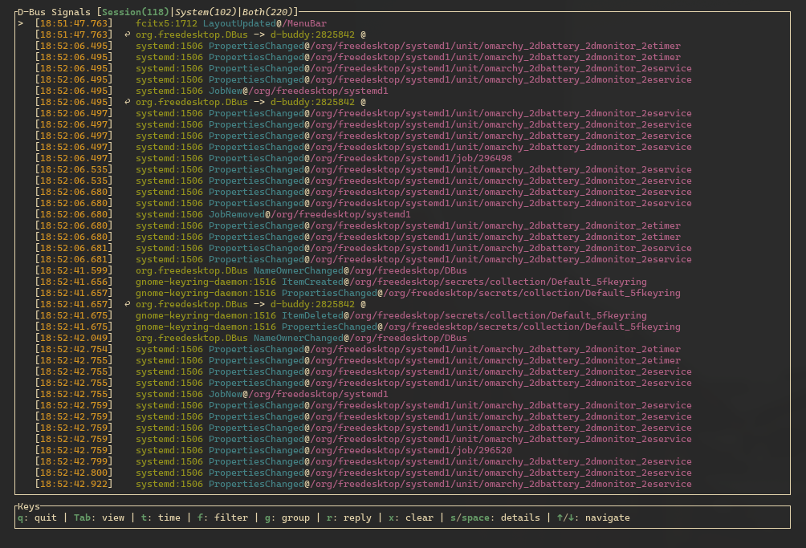
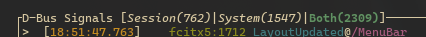
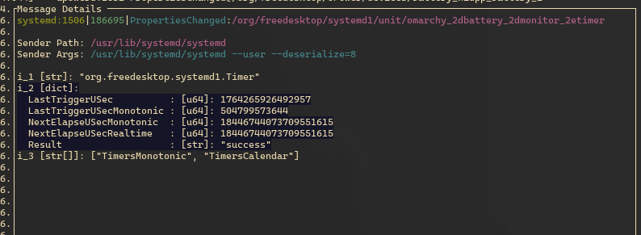
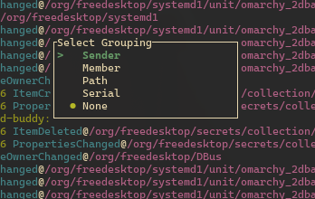
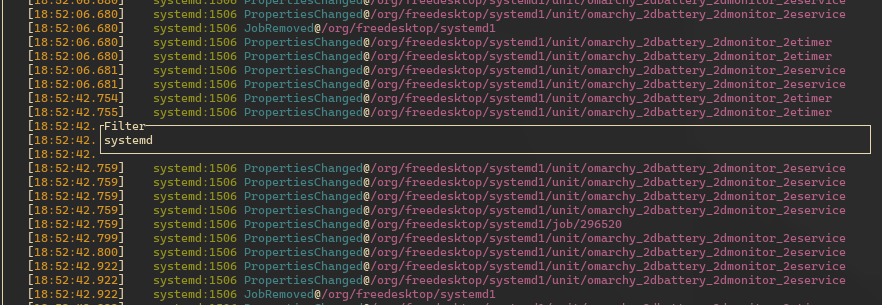
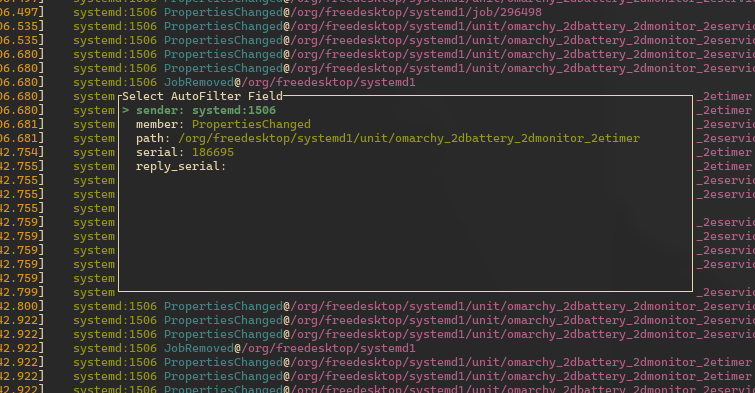

# d-buddy
tui for dbus monitor using rust



you can view system, session buses, or both:




ive opted into completley removing the "signal source id" in the tui and instead use the application where the signal originated from. This will make it easier to understand where the signal came from and how it was generated.. details even has the arguments of how the application started.

## details
every signal have some details.  
ive tried to make it as easy as possible to understand what is going on (ie calling a array of dict objects, a struct and showing data as such).  

However you migh disagree, here as its "not the same type", i want to have a way to differentiate between them and have a "simplistic" view for easy debugging.
This view will have more focus going forwards.



## grouping
you can group, by a single or multiple types at once:




## filtering
filter by type of signal, sender app, path or even if the signal is a reply to another signal. 



dont worry tho. you can select a active signal and grab properties to filter, so you dont have to remember any syntax.



## app arguments

* log: `--log` . also remember to set log level in env: `RUST_LOG=d_buddy=trace`
* enable debug ui: `--debug-ui`
* start and make sure it runs: `--check`


## clipboard - possible issue
from the details view you can copy the clipboard content to the clipboard. 
however there might be either a issue or a delay if you are on wayland. the package that handles this have come code paths 


## Build
```
make build
```

## Run
```
make run
```

## Clean
```
make clean
```
